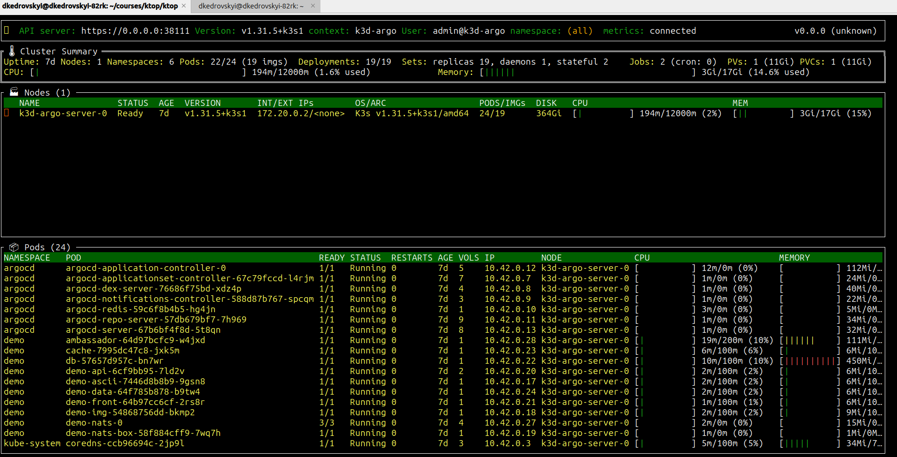

# 1. Install ktop according to https://krew.sigs.k8s.io/docs/user-guide/setup/install/
```bash 

go install github.com/vladimirvivien/ktop@latest
export PATH="/home/dkedrovskyi/go/bin:$PATH"
ktop
``` 


# 2. Plugins 
```bash
(
  set -x; cd "$(mktemp -d)" &&
  OS="$(uname | tr '[:upper:]' '[:lower:]')" &&
  ARCH="$(uname -m | sed -e 's/x86_64/amd64/' -e 's/\(arm\)\(64\)\?.*/\1\2/' -e 's/aarch64$/arm64/')" &&
  KREW="krew-${OS}_${ARCH}" &&
  curl -fsSLO "https://github.com/kubernetes-sigs/krew/releases/latest/download/${KREW}.tar.gz" &&
  tar zxvf "${KREW}.tar.gz" &&
  ./"${KREW}" install krew
)
```

```bash
add to .bashrc 
export PATH="${KREW_ROOT:-$HOME/.krew}/bin:$PATH"
```

(According to https://github.com/vladimirvivien/ktop/blob/main/README.md)

```bash
chmod 755 ./kubeplugin.sh
sudo cp ./kubeplugin.sh /usr/local/bin/kubectl-kubeplugin
```
(According https://kubernetes.io/docs/tasks/extend-kubectl/kubectl-plugins/)
```bash
kubectl plugin list
The following compatible plugins are available:

/home/dkedrovskyi/.krew/bin/kubectl-krew
/usr/local/bin/kubectl-kubeplugin
```

# Examples 

```bash
$ kubectl kubeplugin pod 
Usage: /usr/local/bin/kubectl-kubeplugin <node or pod> <ns>
$ kubectl kubeplugin pod kube-system
pod, kube-system, coredns-ccb96694c-2jp9l, 5m, 32Mi
pod, kube-system, local-path-provisioner-5cf85fd84d-sb7zd, 1m, 19Mi
pod, kube-system, metrics-server-5985cbc9d7-mw5s2, 7m, 42Mi
pod, kube-system, svclb-traefik-78e5afcb-6f7k8, 0m, 0Mi
pod, kube-system, traefik-5d45fc8cc9-hmnd8, 1m, 36Mi
$ kubectl kubeplugin node kube-system
node, kube-system, k3d-argo-server-0, 189m, 1%

```
